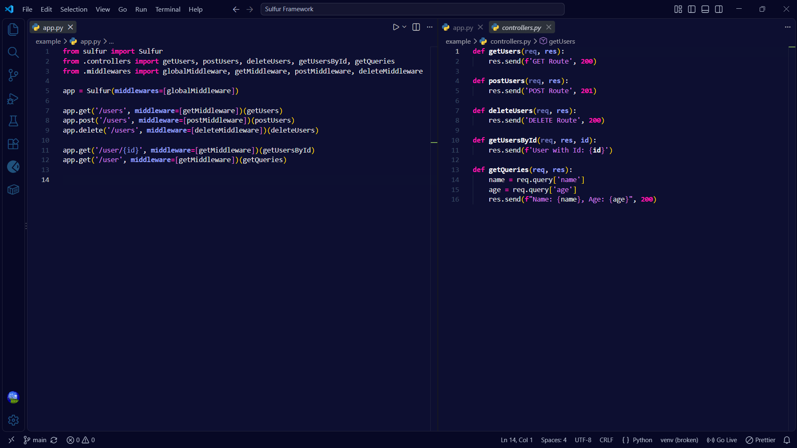
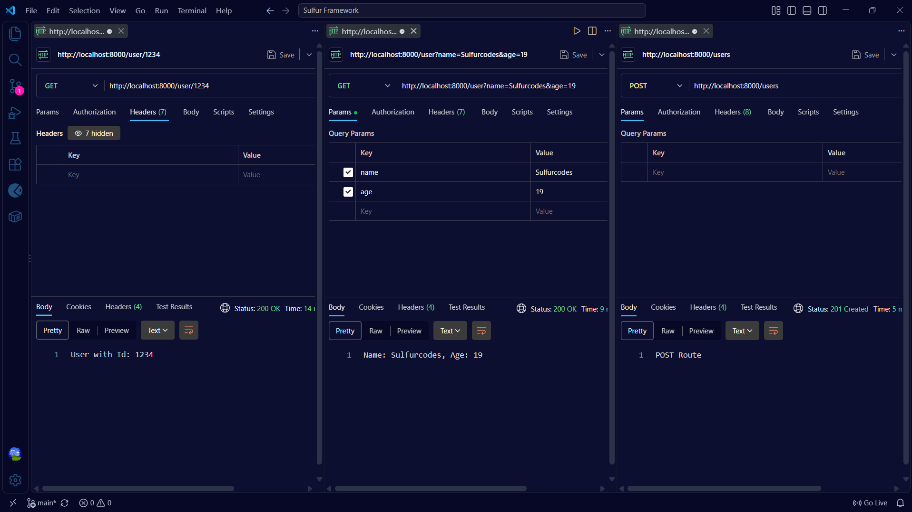
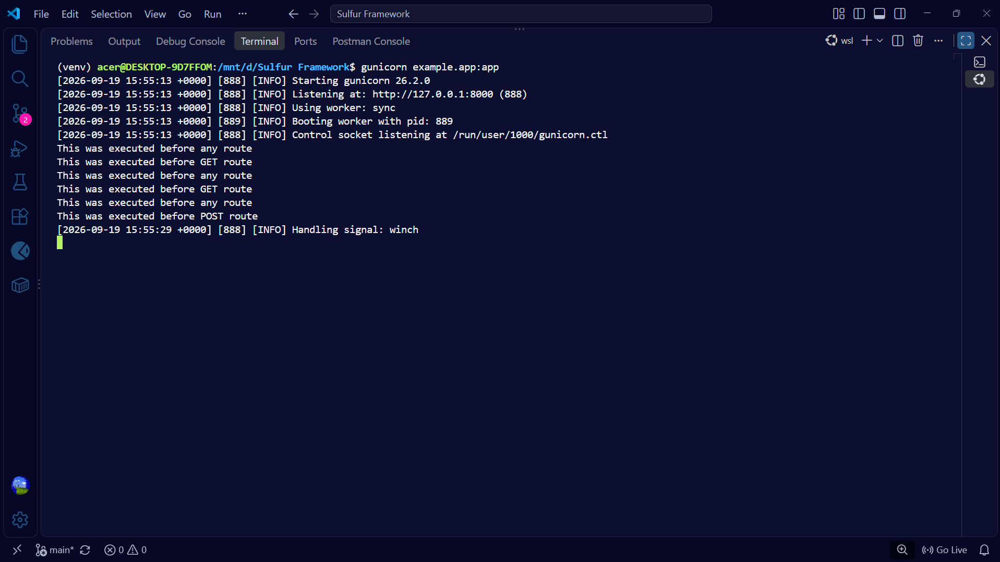
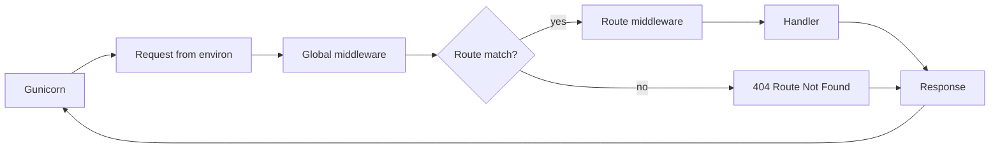

# Sulfur

A lightweight Python backend framework built from scratch on WSGI, featuring a custom request and response layer, a dynamic router, global and route-level middleware, and built-in 404 handling.

[](https://www.python.org/)
[](https://peps.python.org/pep-3333/)
[](https://gunicorn.org/)
[](LICENSE)

> **Quick start:** `pip install parse gunicorn` then `gunicorn example.app:app --reload`

## Preview

**Defining routes and middleware** (`example/app.py` and `example/controllers.py`)



**Hitting the routes from an API client** (path params, query params, and a `201 Created` on POST)



**Running on Gunicorn** (global middleware fires before every request, then the route-specific one)



## What it does

- Implements the WSGI interface directly, so it runs on any WSGI server (developed and served with Gunicorn)
- Wraps the WSGI `environ` in a `Request` object: every entry becomes an attribute (`req.path_info`, `req.request_method`, ...) and the query string is parsed into `req.query`
- Registers routes with a decorator-style API for `GET`, `POST`, and `DELETE`, with the path defaulting to `/<function_name>` when omitted
- Supports dynamic path parameters like `/user/{id}`, passed to the handler as keyword arguments, including typed parameters such as `{n:d}`
- Runs global middleware on every request
- Runs route-specific middleware per path and HTTP method
- Validates middleware at runtime, only plain functions are accepted
- Wraps responses in `res.send(body, status)` with integer or string status codes, a default of `200`, automatic text conversion, and custom headers through `res.headers`
- Returns `404 Route Not Found` for any unmatched route or method
- Reloads automatically in development with Gunicorn's `--reload`

## Tech stack

| Layer           | Tech                                                    |
| --------------- | ------------------------------------------------------- |
| Language        | Python 3                                                |
| Interface       | WSGI (PEP 3333)                                         |
| Server          | Gunicorn                                                |
| Routing         | `parse`, path pattern matching and parameter extraction |
| Request parsing | `urllib.parse`, query string handling                   |

## Usage

Define your handlers, attach middleware, and register routes on a `Sulfur` app.

**`example/app.py`**

```python
from sulfur import Sulfur
from .controllers import getUsers, postUsers, deleteUsers, getUsersById, getQueries
from .middlewares import globalMiddleware, getMiddleware, postMiddleware, deleteMiddleware

app = Sulfur(middlewares=[globalMiddleware])

app.get('/users', middleware=[getMiddleware])(getUsers)
app.post('/users', middleware=[postMiddleware])(postUsers)
app.delete('/users', middleware=[deleteMiddleware])(deleteUsers)

app.get('/user/{id}', middleware=[getMiddleware])(getUsersById)
app.get('/user', middleware=[getMiddleware])(getQueries)
```

**`example/controllers.py`**

```python
def getUsers(req, res):
    res.send('GET Route', 200)

def postUsers(req, res):
    res.send('POST Route', 201)

def deleteUsers(req, res):
    res.send('DELETE Route', 200)

def getUsersById(req, res, id):
    res.send(f'User with Id: {id}')

def getQueries(req, res):
    name = req.query['name']
    age = req.query['age']
    res.send(f"Name: {name}, Age: {age}", 200)
```

Routes can also be registered as decorators:

```python
@app.get('/users/{id}')
def get_user(req, res, id):
    res.send(f'User ID: {id}', 200)

@app.get('/posts/{post_id:d}')      # post_id arrives as an int
def get_post(req, res, post_id):
    res.send(f'Post {post_id}')

@app.get()                          # no path given, registers /hello
def hello(req, res):
    res.send('Hello!')
```

## How it works

Every request travels through the same pipeline:



- **Entry point:** the `Sulfur` instance is the WSGI callable. For each request it receives `environ` and `start_response`, and builds a fresh `Request` and `Response`.
- **Global middleware:** runs first on every request, including ones that end up as a 404. It receives the `Request`.
- **Routing:** registered path patterns are matched with `parse`, and the first path and HTTP method match wins. Placeholders like `{id}` become keyword arguments for the handler.
- **Route middleware:** runs after a match and before the handler, so shared logic and per-route logic stay separate.
- **Handlers:** a handler receives `req`, `res`, and any path parameters, then calls `res.send(body, status)`.
- **No match:** the response is `404 Route Not Found`.
- **Response:** the status line and headers go out through `start_response`, and the encoded body is returned to the server.

### Middleware

Middleware is plain functions that receive the `Request`. Global middleware is passed to the app, and route middleware is passed per route.

```python
# example/middlewares.py
def globalMiddleware(request):
    print('This was executed before any route')

def getMiddleware(request):
    print('This was executed before GET route')
```

Hitting a `GET` route prints, in order:

```
This was executed before any route
This was executed before GET route
```

## Example routes

| Method   | Route        | Handler        | Middleware         | Response                         |
| -------- | ------------ | -------------- | ------------------ | -------------------------------- |
| `GET`    | `/users`     | `getUsers`     | `getMiddleware`    | `200` `GET Route`                |
| `POST`   | `/users`     | `postUsers`    | `postMiddleware`   | `201` `POST Route`               |
| `DELETE` | `/users`     | `deleteUsers`  | `deleteMiddleware` | `200` `DELETE Route`             |
| `GET`    | `/user/{id}` | `getUsersById` | `getMiddleware`    | `200` `User with Id: {id}`       |
| `GET`    | `/user`      | `getQueries`   | `getMiddleware`    | `200` `Name: {name}, Age: {age}` |
| any      | unregistered | none           | global only        | `404` `Route Not Found`          |

## API reference

| API                                        | Description                                                                                           |
| ------------------------------------------ | ----------------------------------------------------------------------------------------------------- |
| `Sulfur(middlewares=[...])`                | Create an app, optionally with global middleware (plain functions taking `request`)                  |
| `app.get(path, middleware=[...])`          | Register a `GET` route, returns a decorator. `path` defaults to `/<handler name>`                    |
| `app.post(path, middleware=[...])`         | Register a `POST` route, returns a decorator                                                          |
| `app.delete(path, middleware=[...])`       | Register a `DELETE` route, returns a decorator                                                        |
| `handler(req, res, **path_params)`         | Handler signature, path parameters arrive as keyword arguments named after the placeholder            |
| `req.query`                                | Query string as a dict, blank values kept and the last value used for repeated keys                   |
| `req.<environ_key>`                        | Any WSGI `environ` entry, lowercased with dots replaced by underscores, e.g. `req.path_info`          |
| `res.send(body, status=200)`               | Set the body and status. Status is an int (`200`, `201`, `204`, `400`, `404`, `405`, `500`) or a full status string |
| `res.headers`                              | List of `(name, value)` tuples sent with the response                                                 |

## Project structure

```
Sulfur-Backend-Framework/
├── example/
│   ├── app.py            # Example app: routes and middleware wiring
│   ├── controllers.py    # Route handlers
│   └── middlewares.py    # Global and route-specific middleware
├── sulfur/
│   ├── __init__.py       # Exposes Sulfur
│   ├── main.py           # Sulfur app: WSGI entry point, middleware pipeline
│   ├── request.py        # Request built from environ, query string parsing
│   ├── response.py       # Response object, status lines, WSGI output
│   └── router.py         # Route registration per method, with route middleware
├── assets/               # README screenshots
├── .gitignore
├── LICENSE
└── README.md
```

## Getting started

### Prerequisites

- Python 3
- Gunicorn (on Windows, run it through WSL)
- `parse`

### Run the example app

```bash
git clone https://github.com/sulfurcodes/Sulfur-Backend-Framework.git
cd Sulfur-Backend-Framework

python -m venv venv
source venv/bin/activate

pip install parse gunicorn
gunicorn example.app:app --reload
```

The server starts at `http://127.0.0.1:8000`.

### Try it out

```bash
curl http://localhost:8000/user/1234
# User with Id: 1234

curl "http://localhost:8000/user?name=Sulfurcodes&age=19"
# Name: Sulfurcodes, Age: 19

curl -X POST http://localhost:8000/users
# POST Route

curl -X DELETE http://localhost:8000/users
# DELETE Route

curl -i http://localhost:8000/missing
# HTTP 404 - Route Not Found
```

## License

MIT